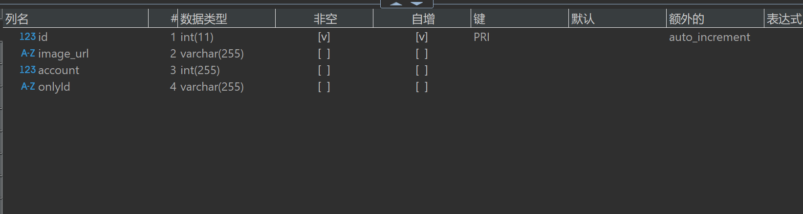

### 启动项目：
```javascript
	node app.js
```

### users 用户表字段
```javascript
	id		用户id
	account	用户名
	password	密码
	identity 身份
	department 	部门
	name 	姓名
	sex		性别
	email		邮箱
	image_url	头像
	create_time	创建时间
	update_time	更新时间
	status 	状态 0 正常 1 停用
```

### image 图片表字段
```javascript
	id		图片id
	image_url	图片路径
	account	上传用户id
	onlyId		图片唯一标识
```

### setting 系统设置表字段
```javascript
	id		设置id
	set_name	设置名称
	set_value	设置值
	set_text	设置描述
```	

### product 产品表
```javascript
	product_id  	入库编号
	product_name	产品名称
	product_category	产品类别
	product_unit	产品单位
	product_inwarehouse_number	产品入库数据 库存
	product_single_price	产品入库单价
	product_all_price	产品入库总价
	product_status	库存状态 100-300为正常，100以下为库存告急，300以上为库存过剩 
	product_create_person	入库操作人
	product_create_time	产品新建时间
	product_update_time	产品最新编辑时间
	in_memo	入库备注
	product_out_id	出库id
	product_out_number	出库数量
	product_out_price	出库总价
	product_out_apply_person	出库申请人
	product_apply_time	申请出库时间
	product_out_status	出库状态 申请出库 or 同意 or 否决
	product_out_date	出库日期
	apply_memo		出库申请  备注
	
```

### outproduct 产品出库审核表
```javascript
	product_out_id	出库id
	product_out_number	出库数量
	product_out_price	出库总价
	product_out_apply_person	出库申请人
	product_audit_time	审核时间
	product_out_audit_person	审核人
	audit_memo	出库 /审核备注
```

### message 消息管理数据表字段
```javascript
	表名 message 
	message_title		消息主题
	message_category		消息类别
	message_publish_department		消息发布部门
	message_publish_name		消息发布者
	message_receipt_object		消息接收者
	message_click_number		消息查看数量
	message_content			消息内容
	message_create_time		消息创建时间
	message_update_time		消息更新时间
	message_level		消息等级
	message_status		默认为0，1在回收站
	message_delete_time		消息删除时间
	
```

### files 文件管理数据表字段
```javascript
	表名 file 
	file_name		文件名称
	file_url		文件路径
	file_size		文件大小
	file_type		文件类型
	upload_person	上传人
	upload_time		上传时间
	download_number	下载次数
```
